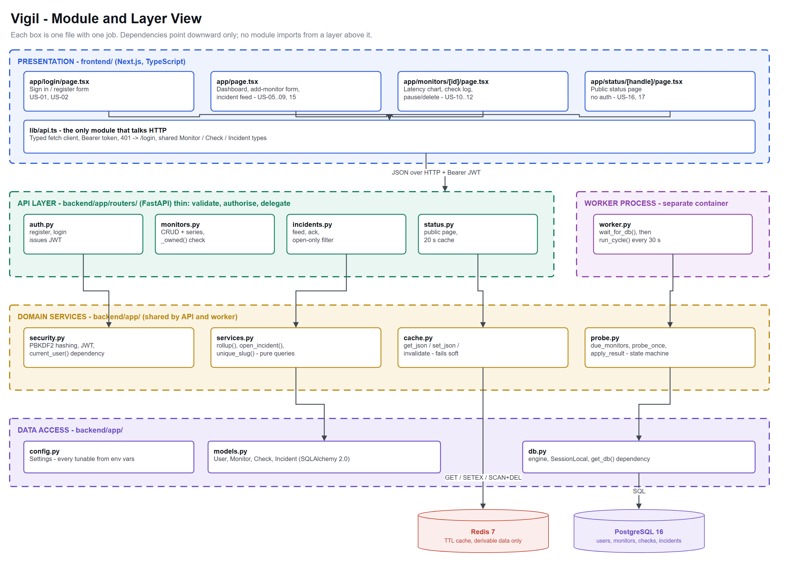
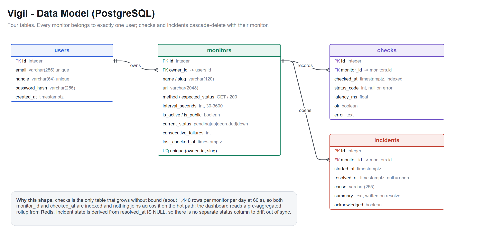
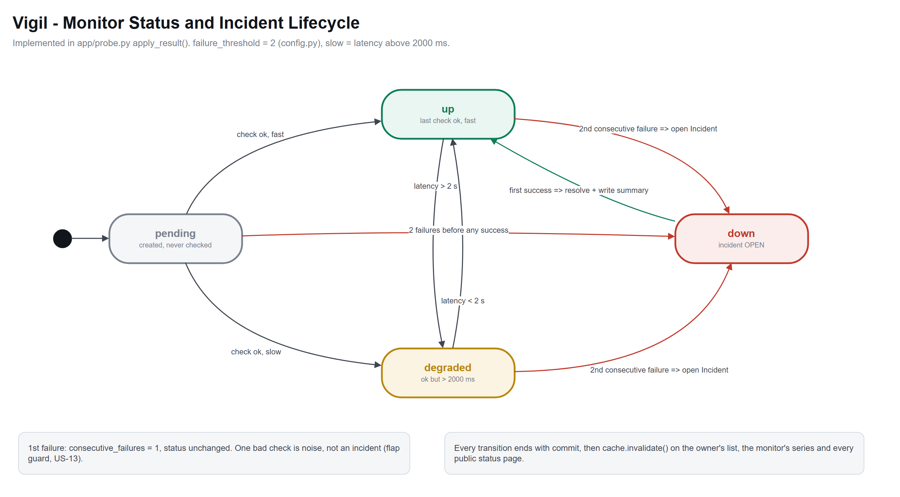

<div align="center">

# Vigil

**Uptime and API monitoring that explains its own outages.**

[](https://github.com/vatsal-agra/vigil/actions/workflows/ci.yml)


[Vision](#1-vision-document) · [Architecture](#3-architecture) · [Software Design](#software-design) · [GitHub setup](#5-github-setup--one-command) · [Quick start](#6-quick-start--local-development) · [Backlog](docs/user-stories.md) · [Wireframes](docs/wireframes)

</div>

---

# 1. Vision document

## 1.1 Project name and overview

**Vigil** is a self-hosted uptime and API monitoring platform. You give it a URL; it checks that URL
on a schedule from a background worker, records every response, and opens an incident on its own when
the service stops answering. When the service recovers, it closes the incident and writes a
one-sentence explanation of what happened.

It ships as five containers — a Next.js frontend, a FastAPI backend, a probe worker, PostgreSQL, and
Redis — that come up together with a single `docker compose up`.

The name is literal. A vigil is a watch kept through the night, when nobody else is looking. That is
the entire job.

## 1.2 The problem it solves

A developer ships a side project, a client site, or an internal API. Then it breaks at 3am, and they
find out at 11am from a message that starts with *"hey, is your site down?"*

The existing options all fail this person in a specific way:

| Option | Why it does not fit |
|---|---|
| **Pingdom, Better Uptime, Datadog** | Priced for companies. The free tiers cap at 1–10 monitors and lock the status page behind a paid plan. |
| **UptimeRobot free tier** | 5-minute check interval and data retention measured in days. You learn about the outage after it ended. |
| **A cron job running `curl`** | No history, no trend, no incident record, and nothing to show a client. It answers "is it up *now*", never "how often does this break". |
| **Uptime Kuma (self-hosted)** | Genuinely good, and the closest comparison. But it is a single monolithic process with SQLite; it has no separate worker, no cache tier, and no plain-language incident narrative. |

The gap Vigil aims at: **an operator who owns 3–20 services and needs history, incident records, and
a customer-facing status page, without a per-monitor subscription.**

## 1.3 Target users

### Persona 1 — Rhea, the solo founder *(primary)*

> 21, final-year CS, runs a small paid SaaS with about 400 users out of her hostel room. Deploys to a
> single VPS. Ships on Friday nights.

- **Goal:** find out about an outage before a customer does, and have something to point customers at that is not a personal apology on WhatsApp.
- **Frustration:** her monitoring is a browser tab she forgets to look at. She has twice discovered downtime from a refund request.
- **What she needs from Vigil:** instant setup, a public status page on her own domain, and email that arrives the moment something breaks.
- **Success looks like:** she never again learns about downtime from a customer.

### Persona 2 — Arjun, the backend engineer at a 12-person startup *(secondary)*

> 27, owns eight internal services. On call every third week.

- **Goal:** distinguish "the API is down" from "the API got 4× slower after this morning's deploy".
- **Frustration:** their alerting fires on single failed checks, so the channel is full of false alarms and everyone has muted it.
- **What he needs from Vigil:** per-endpoint response-time history, a flap guard so one blip is not an incident, and Slack alerts he can trust.
- **Success looks like:** the alert channel becomes worth reading again.

### Persona 3 — Meera, the freelance web developer *(tertiary)*

> 24, maintains 15 client WordPress and Next.js sites on a retainer.

- **Goal:** prove she is providing the uptime her contract promises.
- **Frustration:** paying per-monitor across 15 client sites costs more than one retainer earns.
- **What she needs from Vigil:** unlimited monitors on hardware she already pays for, and a monthly uptime figure per client.
- **Success looks like:** renewal conversations that start from a number instead of a feeling.

## 1.4 Vision statement

> **For** developers and small teams who run services they cannot afford to babysit,
> **who** need to know about failures immediately and explain them afterwards,
> **Vigil** is a self-hosted monitoring platform
> **that** detects outages automatically, records them as incidents in plain language, and publishes
> a status page your users can read.
> **Unlike** hosted monitoring priced per endpoint, or a cron job that leaves no history,
> **Vigil** runs entirely on your own hardware, costs nothing per monitor, and treats the incident
> narrative — not the raw check — as the thing that matters.

## 1.5 Key features and goals

**Shipping in this release**

- **Automatic detection.** A dedicated worker probes each monitor on its own interval. Two consecutive failures open an incident; the next success closes it. The flap guard is deliberate — one bad check is noise.
- **Response-time history.** Every check is stored with its latency, so slow is visible, not just down.
- **Plain-language incidents.** Each resolved incident carries a sentence a non-engineer can read: what broke, how long, and where it stands now.
- **Public status page.** An unauthenticated page per account, served from cache, showing only the services you explicitly publish.
- **One-command setup.** `docker compose up` gives a working system with seeded demo data.

**Explicit non-goals for v1**

- No log aggregation, APM, or tracing. Vigil answers *"is it up and how fast"*, nothing deeper.
- No multi-region probing. A single vantage point is honest about what it can measure.
- No mobile app. The dashboard is responsive; that is enough.
- No multi-tenant SaaS billing. It is self-hosted software, not a product to resell.

## 1.6 Success metrics

| # | Metric | Target | How it is measured |
|---|---|---|---|
| 1 | **Time to first monitor** | Under 90 seconds from `docker compose up` to a monitor being checked | Manual stopwatch on a clean machine, recorded per release |
| 2 | **Detection latency** | Incident opens within 2× the configured interval of the first real failure | Integration test that kills a target container and asserts on `incidents.started_at` |
| 3 | **False-incident rate** | Fewer than 1 spurious incident per monitor per week | Incidents shorter than 60s with no corresponding target-side failure, counted weekly |
| 4 | **Dashboard response time** | p95 under 200 ms for the monitor list at 50 monitors | Locust run against a seeded database; Redis cache is what makes this pass |
| 5 | **Cold-start reliability** | 10 consecutive `compose down -v && compose up` cycles reach healthy with no manual steps | Scripted in CI |
| 6 | **Backlog completion** | 100% of Must-have stories closed by M1 | GitHub Project board |

## 1.7 Assumptions and constraints

**Assumptions**

- Users are comfortable with a terminal and Docker. This is developer software and it does not apologise for that.
- The host has a stable outbound network. A probe failure caused by the *host's* connection is indistinguishable from a target failure — a known limitation, documented rather than hidden.
- Users own the endpoints they monitor. There is no consent workflow.
- HTTP/HTTPS checks cover the overwhelming majority of need. TCP, ICMP, and DNS checks are deferred.
- A minimum 30-second interval is acceptable. Anything faster is a load test, not monitoring.

**Constraints**

| Kind | Constraint |
|---|---|
| **Time** | One academic semester, one developer. This is the binding constraint and it is what MoSCoW exists to manage. |
| **Hardware** | Must run on a Raspberry Pi 5 (8 GB). Every image is `slim`/`alpine`; no image exceeds 400 MB. Rules out Elasticsearch-class dependencies. |
| **Cost** | ₹0 of recurring spend. GitHub Actions free tier, Cloudflare free tier, self-hosted everything. |
| **Data** | Checks accumulate at roughly 1,440 rows per monitor per day at a 60s interval. Retention and downsampling are required before this is production-grade — currently a documented debt item. |
| **Security** | Self-hosted means the operator owns their own TLS and secrets. Vigil ships no default credentials in production mode and refuses to start with the default `JWT_SECRET` when `ENV=production`. |
| **Skill** | Solo build across Python, TypeScript, SQL, and Docker. Anything needing a fifth stack was cut, which is why alerting uses plain SMTP rather than a queue. |

---

# 2. Repository structure

```
vigil/
├── .github/
│   ├── ISSUE_TEMPLATE/          user-story and bug-report forms
│   ├── workflows/ci.yml         pytest · next build · docker build
│   └── pull_request_template.md
├── backend/
│   ├── app/
│   │   ├── main.py              FastAPI app, lifespan, /health
│   │   ├── config.py            env-driven settings
│   │   ├── db.py                engine + session factory
│   │   ├── models.py            User · Monitor · Check · Incident
│   │   ├── schemas.py           Pydantic request/response contracts
│   │   ├── security.py          PBKDF2 hashing, JWT issue/verify
│   │   ├── cache.py             Redis helpers, degrade-gracefully
│   │   ├── services.py          shared queries (uptime rollups, slugs)
│   │   ├── probe.py             the checking engine + incident state machine
│   │   ├── seed.py              demo account and backfilled history
│   │   └── routers/             auth · monitors · incidents · status
│   ├── tests/
│   ├── worker.py                probe loop entrypoint
│   ├── requirements.txt
│   └── Dockerfile               targets: base · dev · prod · worker
├── frontend/
│   ├── app/
│   │   ├── page.tsx             dashboard
│   │   ├── login/               sign in / register
│   │   ├── monitors/[id]/       detail + response-time chart
│   │   ├── status/[handle]/     public status page
│   │   └── globals.css          design tokens and component styles
│   ├── lib/api.ts               typed fetch client, session handling
│   └── Dockerfile               targets: deps · dev · builder · prod
├── infra/
│   ├── architecture.drawio      the system diagram (open at diagrams.net)
│   └── caddy/Caddyfile          production reverse proxy
├── docs/
│   ├── user-stories.md          25 stories, acceptance criteria, MoSCoW
│   └── wireframes/              6 screens as SVG (import into Figma)
├── scripts/
│   ├── seed-issues.sh           bulk-create the backlog on GitHub
│   └── make_wireframes.py       regenerates the wireframe SVGs
├── docker-compose.yml
├── .env.example
└── .gitignore
```

---

# 3. Architecture

The full diagram lives at [`infra/architecture.drawio`](infra/architecture.drawio) — open it at
[diagrams.net](https://app.diagrams.net) via **File → Open from → Device**.

```
                                    ┌─────────────────────────────────────────────┐
 Dashboard user ──HTTPS──┐          │  Raspberry Pi 5 · network: vigil_default    │
                         ├─▶ Caddy ─┼──▶  web ──REST+JWT──▶  api ──┬──▶ cache      │
 Public visitor ──HTTPS──┘   (TLS)  │  (Next.js)         (FastAPI) │   (Redis 7)   │
                                    │                              └──▶ db         │
                                    │                         ┌────────▶ (Postgres)│
                                    │   worker ───────────────┘         │          │
                                    │  (probe loop)                     ▼          │
                                    └───────┬───────────────────── vigil_pgdata ───┘
                                            │
                                            ▼
                                   monitored endpoints
```

**Why each piece is there**

- **Separate worker container.** Probing is slow and blocking; a timing-out check should never occupy a request thread. Splitting it means the API stays responsive during an outage — exactly when people are reloading the dashboard.
- **Redis, not just an ORM cache.** The public status page is the one endpoint that gets a traffic spike precisely when the system is already unhealthy. A 20-second TTL means a thousand worried customers hitting the status page produce three database queries a minute. The worker invalidates keys on write, so the cache is never stale by more than one probe cycle.
- **PostgreSQL over SQLite.** Two processes write to `checks` concurrently. SQLite's writer lock makes that a correctness problem rather than a performance one.
- **A named volume, not a bind mount.** Database files in a bind mount on a Pi's SD card are a data-loss story waiting to happen.

**Request path for the dashboard**

1. Browser sends `GET /api/monitors` with a Bearer token.
2. `security.current_user` verifies the JWT and loads the user.
3. The router checks Redis for `monitors:list:<user_id>`. On a hit it returns immediately.
4. On a miss it queries Postgres, computes the 24-hour rollup per monitor, writes the result to Redis with a 15-second TTL, and returns.
5. Meanwhile the worker writes new checks and deletes those keys, so the next read is fresh.

---

# Software Design

Vigil is a **layered monolith deployed as cooperating containers**. The frontend talks to the backend only through one typed client ([`lib/api.ts`](frontend/lib/api.ts)). Thin FastAPI routers delegate to shared domain modules, and the probe worker is a separate process that reuses those same modules, so an outage can never slow down the dashboard reporting it. The API and worker never call each other: they meet only at the database and a cache-key convention (Redis is cache-aside, invalidated on every write, and fails soft). That keeps coupling low enough that alerting, new check types or multi-region probing each land in one module.

Full write-up with code snippets: [**Software Design Document (PDF)**](docs/design/Vigil_Software_Design_Document.pdf) · all sources in [`docs/design/`](docs/design)

| Diagram | Editable source | What it shows |
|---|---|---|
| System architecture | [`01-architecture.drawio`](docs/design/diagrams/01-architecture.drawio) | Client → edge → frontend → API → cache / database, plus the worker |
| Module and layer view | [`02-module-layers.drawio`](docs/design/diagrams/02-module-layers.drawio) | Every file, its layer, and its downward-only dependencies |
| Data model | [`03-data-model.drawio`](docs/design/diagrams/03-data-model.drawio) | Four tables and their relationships |
| Monitor state machine | [`04-monitor-state-machine.drawio`](docs/design/diagrams/04-monitor-state-machine.drawio) | Status transitions and the incident lifecycle in `probe.py` |



<details>
<summary>Data model and state machine</summary>




</details>

**UI:** the six Review 1 wireframes (SVG; drag them into Figma to get editable frames) sit next to screenshots of the implemented screens in [`docs/design/ui/`](docs/design/ui).

Regenerate the diagrams with `python scripts/make_design_diagrams.py && python scripts/export_diagrams.py`, and the PDF with `python docs/build/build_sdd.py`.

---

# 4. Branching strategy — GitHub Flow

`main` is always deployable. There is no `develop`, no release branch, and no long-lived
integration branch — with one developer, those exist only to create merge conflicts with yourself.

```
main  ──●────────●────────────●────────●──▶  always deployable, protected
         \      /              \      /
          ●────●                ●────●
      feat/us-13-probe-worker   feat/us-16-status-page
```

**The rules**

1. **Branch off `main` for every unit of work.** One branch per issue.
2. **Name the branch after the story:** `<type>/us-<id>-<slug>`.
   - `feat/us-13-probe-worker`
   - `fix/us-08-uptime-excludes-timeouts`
   - `chore/us-25-ci-pipeline`
   - `docs/vision-document`
3. **Commit in [Conventional Commits](https://www.conventionalcommits.org/) form,** referencing the issue:
   ```
   feat(engine): open an incident after two consecutive failures

   Adds the flap guard so a single blip does not page anyone.
   Refs #13
   ```
4. **Open a PR early.** The PR description links the issue with `Closes #13`, so merging closes the story and moves the board card.
5. **CI must be green.** `pytest`, `next build`, and both `docker build`s run on every PR. `main` is branch-protected against direct pushes and failing checks.
6. **Squash-merge, then delete the branch.** One story, one commit on `main`, readable history.

**Working a story end to end**

```bash
git switch main && git pull
git switch -c feat/us-16-public-status-page

# ... work, committing as you go ...
git add -A
git commit -m "feat(status): serve a cached public status page

Refs #16"

git push -u origin feat/us-16-public-status-page
gh pr create --fill --base main
gh pr merge --squash --delete-branch
```

---

# 5. GitHub setup — one command

The repository scaffolding (labels, backlog, project board, branches) is scripted so it is
reproducible rather than hand-clicked.

```bash
gh auth login                            # once
gh auth refresh -s project,read:project  # Projects v2 needs this extra scope

./scripts/bootstrap-github.sh
```

That single command:

1. Verifies `git`, `gh`, `jq`, authentication, the `project` scope, and your git identity.
2. Initialises the repo, commits, and pushes `main`.
3. Creates 15 labels — six `epic:*`, four MoSCoW, five discipline.
4. Creates all 25 user-story issues with acceptance criteria as checklists.
5. Creates the **Vigil — Product Backlog** project, adds `MoSCoW`, `Epic`, and `Points` fields, adds all 25 issues, and sets every field value by reading the labels.
6. Creates and pushes `feat/us-16-public-status-page`.
7. Attempts branch protection on `main` requiring CI to pass.

Every step is idempotent — re-running skips what already exists.

| Script | Does |
|---|---|
| `scripts/bootstrap-github.sh` | Orchestrates all of the below |
| `scripts/stories.sh` | The 25 stories as data. Single source of truth, sourced by the others |
| `scripts/seed-issues.sh` | Labels and issues only |
| `scripts/setup-project-board.sh` | Project board, fields, and field values only |
| `scripts/make_wireframes.py` | Regenerates the six wireframe SVGs |

---

# 6. Quick start — local development

## 5.1 Prerequisites

| Tool | Version | Check with |
|---|---|---|
| Docker Desktop (or Engine + Compose v2) | 24+ | `docker --version && docker compose version` |
| Git | 2.40+ | `git --version` |
| GitHub CLI | 2.x | `gh --version` — only for the repo scripts, not for running the app |
| jq | 1.6+ | `jq --version` — only for the project-board script |

Python and Node run inside the containers — you do not need either on the host.

## 5.2 Run it

```bash
git clone https://github.com/vatsal-agra/vigil.git
cd vigil

cp .env.example .env        # optional; compose has working defaults

docker compose up --build
```

First build takes 2–4 minutes. Subsequent starts are a few seconds.

When it is ready:

| What | Where |
|---|---|
| **Dashboard** | http://localhost:3000 |
| **Public status page** | http://localhost:3000/status/demo |
| **API docs (Swagger)** | http://localhost:8000/docs |
| **Health check** | http://localhost:8000/health |

**Demo account**, seeded automatically on an empty database:

```
email:    demo@vigil.dev
password: vigil-demo-2026
```

It arrives with four monitors and 24 hours of backfilled check history, so the dashboard, the chart,
and the incident feed are all populated the moment you sign in.

## 5.3 Verify everything is up

```bash
docker compose ps
```

```
NAME            IMAGE              STATUS                   PORTS
vigil-api-1     vigil-api          Up (healthy)             0.0.0.0:8000->8000/tcp
vigil-cache-1   redis:7-alpine     Up (healthy)             0.0.0.0:6379->6379/tcp
vigil-db-1      postgres:16-alpine Up (healthy)             0.0.0.0:5432->5432/tcp
vigil-web-1     vigil-web          Up                       0.0.0.0:3000->3000/tcp
vigil-worker-1  vigil-worker       Up
```

```bash
curl -s localhost:8000/health | python -m json.tool
```

```json
{
    "status": "ok",
    "api": "ok",
    "database": "ok",
    "cache": "ok"
}
```

Watch the worker actually doing its job:

```bash
docker compose logs -f worker
```

```
vigil.worker  INFO  worker online, cycle every 30s
vigil.probe   INFO  checked Marketing site -> ok (184.2 ms)
vigil.probe   INFO  checked Checkout API -> ok (211.7 ms)
vigil.probe   INFO  checked Legacy invoice worker -> fail (None ms)
vigil.worker  INFO  cycle complete, 4 monitor(s) checked
```

## 5.4 Everyday commands

```bash
docker compose up                    # start (after the first build)
docker compose up --build            # rebuild after changing a Dockerfile or dependency
docker compose down                  # stop, keep the database
docker compose down -v               # stop and wipe the database (re-seeds on next start)
docker compose logs -f api worker    # follow specific services
docker compose restart worker        # restart one service

docker compose exec api pytest -q                    # run the backend tests
docker compose exec db psql -U vigil -d vigil        # open a SQL shell
docker compose exec cache redis-cli KEYS 'monitors*' # inspect the cache
```

Both `api` and `web` bind-mount their source, so edits reload live — no rebuild needed for code
changes.

## 5.5 Production images

The Dockerfiles are multi-stage. `dev` is the default (hot reload); `prod` builds the optimised
images:

```bash
BACKEND_TARGET=prod FRONTEND_TARGET=prod docker compose up --build
```

`prod` runs Uvicorn with two workers and serves Next.js from its standalone output — no `node_modules`
in the final image.

## 5.6 Troubleshooting

| Symptom | Cause | Fix |
|---|---|---|
| `port is already allocated` | Something else holds 3000, 5432, 6379, or 8000 | `lsof -i :5432`, stop it, or remap the left-hand side in `docker-compose.yml` |
| Dashboard shows "Could not reach the API" | `NEXT_PUBLIC_API_URL` is a container hostname | It must be a **browser-reachable** address — `http://localhost:8000`, not `http://api:8000` |
| `relation "monitors" does not exist` | Volume from an older schema | `docker compose down -v && docker compose up` |
| Worker restarts in a loop | Postgres was not ready | Already handled by `wait_for_db`; if it persists, check `docker compose logs db` |
| No demo data | The database was not empty | `docker compose down -v`, then start again |

---

# 7. Local development tools

| Tool | Version | Why it is in this project |
|---|---|---|
| **Docker Desktop** | 24+ | Runs all five services. The only host dependency. |
| **Docker Compose v2** | bundled | Service graph, health-gated startup ordering, named volumes. |
| **VS Code** | latest | Editor. Extensions: Python, Pylance, Ruff, ESLint, Prettier, Docker, Tailwind-less CSS IntelliSense, GitLens. |
| **Dev Containers** *(optional)* | — | Attach VS Code directly to the `api` container for a debugger against the real environment. |
| **Git + GitHub CLI (`gh`)** | 2.40+ / 2.x | Version control; `gh` creates issues, PRs, and the project board from the terminal. `scripts/seed-issues.sh` depends on it. |
| **pytest** | 8.3 | Backend tests. Runs in CI and inside the container. |
| **Ruff** | latest | Python lint + format. `ruff check backend && ruff format backend`. |
| **TypeScript** | 5.7 | Compile-time contract between `lib/api.ts` and every component. `next build` fails on a type error, so drift cannot ship. |
| **Swagger UI** | via FastAPI | Auto-generated from the Pydantic schemas at `/docs`. Used to exercise endpoints before the UI exists. |
| **`psql` / `redis-cli`** | in-container | Inspect state directly during debugging. |
| **draw.io (diagrams.net)** | web | The architecture diagram. Source committed as `.drawio`, so it stays diffable. |
| **Figma (free tier)** | web | The six wireframes. SVG sources in `docs/wireframes/` import as editable frames. |
| **GitHub Actions** | hosted | CI on every PR. |

---

# 8. Testing

```bash
docker compose exec api pytest -q          # inside the running stack
cd backend && pytest -q                    # or on the host, with deps installed
cd frontend && npm run build               # type-check + production build
```

---

# 9. Deployment

Target: a Raspberry Pi 5 running Ubuntu Server, reachable through a Cloudflare Tunnel — no ports
forwarded on the home router, no public IP exposed.

```bash
# on the Pi
git clone https://github.com/vatsal-agra/vigil.git && cd vigil

cp .env.example .env
sed -i "s/^JWT_SECRET=.*/JWT_SECRET=$(openssl rand -hex 32)/" .env
sed -i "s/^BACKEND_TARGET=.*/BACKEND_TARGET=prod/" .env
sed -i "s/^FRONTEND_TARGET=.*/FRONTEND_TARGET=prod/" .env

docker compose up -d --build
```

Caddy terminates locally and routes `/api/*` to the API and everything else to the web container —
see [`infra/caddy/Caddyfile`](infra/caddy/Caddyfile). The Cloudflare Tunnel points at Caddy, which
gives TLS and DDoS protection without opening a port.

Merging to `main` builds and publishes both images; the Pi pulls and restarts:

```bash
docker compose pull && docker compose up -d
```

---

# 10. Deliverables map

| Assignment requirement | Where it lives |
|---|---|
| Vision document as Markdown in README | [§1](#1-vision-document) above |
| 25 user stories as GitHub Issues | [`docs/user-stories.md`](docs/user-stories.md) → `scripts/seed-issues.sh` |
| MoSCoW prioritisation | [`docs/user-stories.md`](docs/user-stories.md#moscow-summary) and the `must/should/could/wont-have` labels |
| Figma wireframes, 6 screens | [`docs/wireframes/`](docs/wireframes) |
| Architecture diagram in Draw.io | [`infra/architecture.drawio`](infra/architecture.drawio) |
| Folder structure | [§2](#2-repository-structure) |
| `.gitignore` | [`.gitignore`](.gitignore) |
| Branching strategy | [§4](#4-branching-strategy--github-flow), automated by `scripts/bootstrap-github.sh` |
| GitHub Project board | `scripts/setup-project-board.sh` — MoSCoW / Epic / Points fields |
| Dockerfiles | [`backend/Dockerfile`](backend/Dockerfile), [`frontend/Dockerfile`](frontend/Dockerfile) |
| Quick Start — Local Development | [§6](#6-quick-start--local-development) |
| Local development tools | [§7](#7-local-development-tools) |
| **Review 2** — Software Design Document | [`docs/design/Vigil_Software_Design_Document.pdf`](docs/design/Vigil_Software_Design_Document.pdf) |
| **Review 2** — `/docs/design/` with draw.io sources, PNG exports, UI screens | [`docs/design/`](docs/design) |
| **Review 2** — README "Software Design" section | [Software Design](#software-design) above |

---

<div align="center">
<sub>Built for Software Engineering, VIT Chennai · 2026</sub>
</div>
